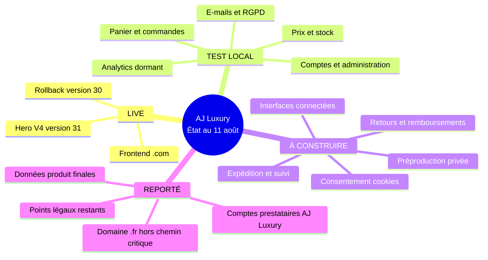
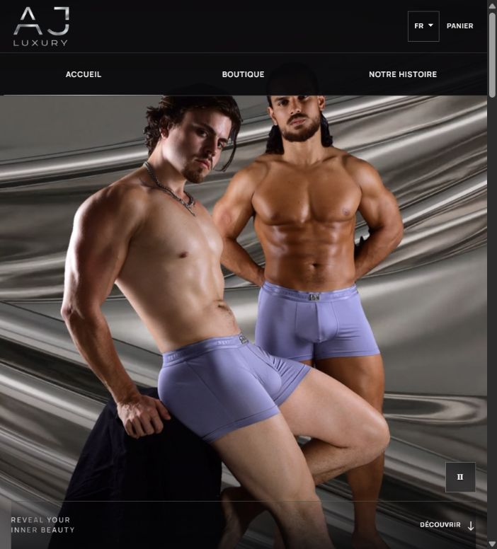
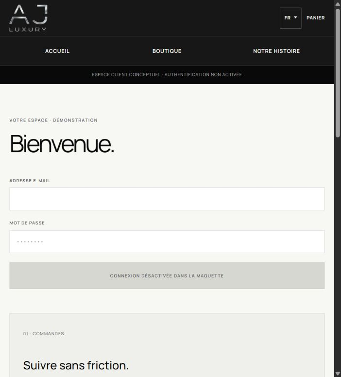
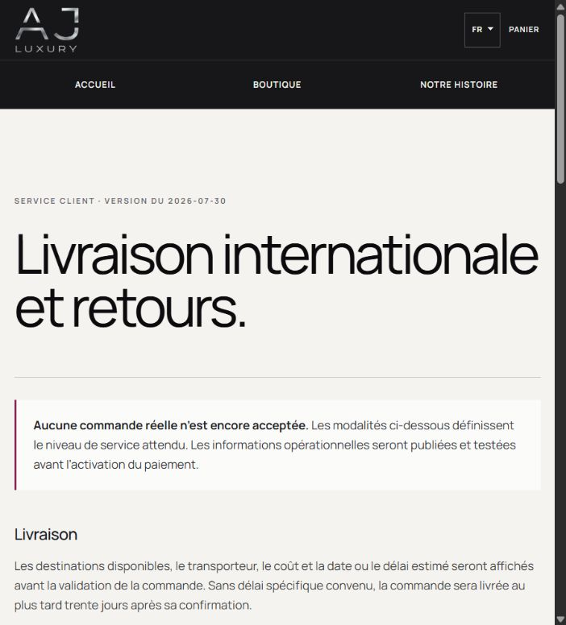

# AJ Luxury | Vue dirigeant du Lot 2

**FRONT `.COM` LIVE | LOT 2 EN TEST LOCAL | VENTES RÉELLES DÉSACTIVÉES | `.FR` REPORTÉ**

Dernière mise à jour : 11 août 2026

Décideur final : Adam CHABBI

Validation métier avant activation : Jérémy SCHEPPLER

## Verdict

La vitrine et Hero V4 sont en ligne sur `ajluxurystore.com`. Le cœur e-commerce a passé
son contrôle complet reproductible en local. La construction de la logistique est lancée
dans un environnement séparé. Aucun paiement, transporteur, e-mail réel, compte client connecté, base distante
ou analytics n’est activé : **le site ne peut pas encore accepter une commande réelle**.

## Ce qui est fait

- **Hero V4 live** : version 31 publiée et contrôlée sur mobile et desktop, sans rollback.
- **Socle commerce accepté** : une seule version locale réunit stock, panier, commandes, comptes, administration, e-mails/RGPD et mesure d’audience inactive.
- **Sécurité locale** : base SQL, anti-survente, isolation des comptes, absence de double effet et droits sur les données testés.
- **Contrôle complet** : 188/188 tests verts en un seul lancement, sans modification ni service distant.
- **International préparé** : règles d’adresse UE, Royaume-Uni, États-Unis et Canada testées ; toute autre destination reste fermée.

## Lecture visuelle honnête

**Accueil public actuel : LIVE.** La vidéo V4 est le seul changement de production de
cette vague.

**Compte client public : interface conceptuelle, pas une fonction connectée.** Le moteur
de sécurité existe uniquement dans le candidat local en contrôle.

**Livraison publique : information de pré-lancement, pas un transporteur actif.** Les
règles d’adresse sont testées localement ; tarifs, étiquettes, suivi et retours restent à
construire puis connecter.

## État par bloc

| Statut | Bloc | Preuve actuelle | Prochaine porte |
|---|---|---|---|
| `LIVE` | Front `.com` et Hero V4 | Version Sites 31, smoke indépendant PASS | Surveillance ; rollback 30 conservé |
| `TEST LOCAL` | Commerce, stock, comptes, admin, e-mails/RGPD | Version intégrée locale, 21 tables, 188/188 tests verts en un seul lancement | Socle accepté ; aucune activation réelle |
| `À CONSTRUIRE` | Expédition, suivi, retours, remboursements | Périmètre audité et exécution locale lancée ; aucun candidat encore accepté | Candidat figé puis contrôle indépendant |
| `À CONSTRUIRE` | Cookies, consentement, analytics | Périmètre lean audité ; mesure présente mais inactive, aucune collecte | Après le bloc logistique |
| `REPORTÉ` | Redirection `.fr` vers `.com` | Domaine parqué ; aucune duplication du site | Handoff séparé après le lancement `.com` |

## Suite

- **Adam / technique** : construire la logistique localement, puis la faire auditer par des agents distincts.
- **Adam / technique** : construire le consentement cookies et connecter les interfaces, toujours hors production.
- **Adam + Jérémy** : tester paiement, transport et e-mails uniquement avec des comptes de test AJ Luxury.
- **Adam puis Jérémy** : valider la même préproduction privée avant toute activation.
- **Adam / technique** : prouver sauvegarde, restauration, alertes et reprise avant le go-live.

## Manques et blocages

- **Domaine `.fr`** : aucune action requise pour le lancement ; redirection traitée ultérieurement dans un handoff séparé.
- **Jérémy** : confirmer réserves cadeaux/SAV et stock réellement vendable par variante.
- **Jérémy** : fournir poids/dimensions du colis, origine, guide des tailles, entretien, étiquettes et dispositif d’hygiène.
- **Jérémy / AJ Luxury** : ouvrir les comptes paiement, transport et e-mail avec double authentification et vérification d’identité ; aucun compte personnel Adam ne sera utilisé.
- **Jérémy / AJ Luxury** : fermer médiateur, téléphone, TVA, identifiant douanier EORI, droits/taxes, sous-traitants et mentions, avec les conseils appropriés en appui.

## Gate « boutique réellement ouverte »

Les cinq lignes doivent être vertes ensemble :

1. **Produit** : stock vendable signé et informations produit complètes.
2. **Vente** : compte, panier, checkout, commande et administration connectés.
3. **Opérations** : paiement, e-mails, livraison, suivi, retours et remboursements testés avec les prestataires en mode test.
4. **Confiance** : droit, RGPD, cookies, consentement, sauvegarde et restauration validés.
5. **Activation** : préproduction exacte validée par Adam puis Jérémy, suivie d’une recette de production.

## Sources de preuve

- [Release Hero V4](internal/RELEASE-HANDOFF-HERO-V4-2026-08-10.md)
- [Plan Lot 2](BACKEND-LOT-2-ACTION-PLAN.md)
- Périmètres approuvés : [logistique D03](internal/LOT-2-D03-FULFILLMENT-SCOPE-2026-08-11.md) et [consentement A02](internal/LOT-2-A02-CONSENT-ANALYTICS-SCOPE-2026-08-11.md)
- [Journal technique détaillé](internal/LOT-2-TECHNICAL-JOURNAL-2026-08-11.md)
- [Domaine `.fr`](internal/DOMAIN-PROTECTION-FR-2026-08-10.md)
