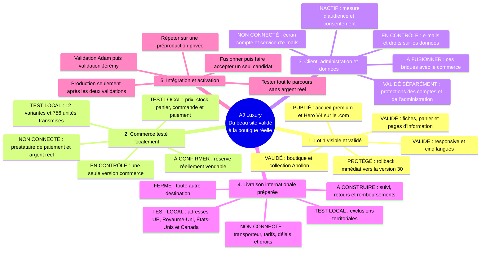

# AJ Luxury | Journal technique du Lot 2

> ANNEXE TECHNIQUE — historique et preuves détaillées. La vue dirigeant canonique
> est `docs/LOT-2-IMPLEMENTATION-STATUS.md`. Ce journal ne doit pas être utilisé seul
> pour conclure qu’une fonction est live.

Statut : `STATUT ACTUEL | TEST UNIQUEMENT | AUCUNE ACTIVATION`

Dernière mise à jour : 11 août 2026

Décideur final : Adam CHABBI

Décideur métier avant production : Jérémy SCHEPPLER

Plan de référence : `docs/BACKEND-LOT-2-ACTION-PLAN.md`

## Verdict

Les coulisses de la boutique sont construites et contrôlées dans des environnements de
test séparés. Aucun paiement, transporteur, service d’e-mails ou parcours client complet
n’est encore connecté. La mise en ligne reste interdite tant qu’une seule version n’a pas
passé tous les contrôles puis reçu les validations d’Adam et de Jérémy.

## Vue dirigeant : du Lot 1 validé à la boutique réelle

### Trois écrans pour lire correctement l’avancement

**Lot 1 visible et validé : l’accueil premium.**

**Compte client : l’écran existe, mais indique encore honnêtement que l’authentification
n’est pas activée. Le chantier Compte client a passé ses tests isolés avant connexion à
cette interface.**

**Livraison internationale : cette capture prouve seulement que l’information de
pré-lancement est visible. Les pays, formats d’adresse et exclusions relèvent de tests
séparés. Transporteur, tarifs, délais, droits et suivi restent non connectés.**

## Système d’exécution

Capacité active : `3 sous-agents en parallèle + pilotage racine`.

Le pilotage racine arbitre, tient ce cockpit et intègre. Chaque ligne suit le même relais :

`EXÉCUTANT -> RED TEAM INDÉPENDANTE -> CORRECTION -> JURY INDÉPENDANT -> SHA ACCEPTÉ`

Un agent ne valide jamais son propre travail. Un test vert ne remplace jamais le verdict du
jury. Un commit refusé reste isolé et n’entre pas dans le candidat d’intégration.

| Ligne MECE | Périmètre | Agent actif | Entrée gelée | Sortie attendue |
|---|---|---|---|---|
| Transaction commerce | Catalogue, panier, stock, commande, paiement, audit | Rejeu déterministe I06 en cours | I06 `f5ba52d` gelé ; jury métier PASS, jury technique bloqué par un `fetch failed` Wrangler local | Obtenir une suite complète verte et reproductible sur le SHA exact |
| Client et conformité | Comptes, administration, e-mails, RGPD, cookies, analytics | I06 accepté sur le fond, activation interdite | D01, D02 et Analytics dormant réunis dans `f5ba52d` | Lever uniquement le défaut de reproductibilité du test local |
| Fulfillment | Zones, expédition, suivi, retours, remboursements | Oracle D03 terminé, implémentation en attente du PASS I06 | Spécification `0005` et tests veto prêts | Exécuter D03 seulement après le PASS reproductible I06 |

Vague active : I06 est gelée au SHA `f5ba52d94c53963f52a24b9edcc6c84033b2f1f6`.
La suite intégrée de l’exécutant est verte : commerce 81/81, identité 24/24,
e-mails/RGPD 12/12, migrations D1 canonique et ciblée vertes, rendu/i18n 47/47 et
politiques 22/22. Un jury indépendant a confirmé 117/117 contrôles ciblés et le fond
I06. Un second jury a validé build, canaries, tests principaux, identité, e-mail, lint
et sécurité, mais son test D1 Wrangler local a terminé sur `fetch failed`. Ce résultat
ne prouve pas une régression métier, mais interdit encore le PASS final jusqu’à un
rejeu complet reproductible.
Analytics reste dormant et aucun prestataire réel n’est activé.
Le portage Analytics `e8d2f18`
reste provisoirement accepté mais ne sera reporté qu’après acceptation I04/D01/D02.
D01/D02/D03/A02 restent numérotés `0003` à `0006`.

Les branches isolées `codex/lot2-integration-wave1-20260811` et
`codex/lot2-integration-i03-20260811` portent les SHA refusés `50cabaf` et `f0b91e2`.
Le candidat I04 gelé est dans `codex/lot2-integration-i04-20260811`, worktree séparé.
Toutes restent locales, non intégrées au checkout canonique et non publiées.

### Journal des relais

| Paquet | Rôle indépendant | SHA | Verdict / preuve |
|---|---|---|---|
| `L2-C01` | Jury initial | `46cf923` | FAIL, 3 P1 |
| `L2-C01` | Exécutant correction | `0bee575` | Gelé, 94/94 + D1 vide/rejeu |
| `L2-C01` | QA comptable indépendante | `0bee575` | FAIL, 3 P1 |
| `L2-C01` | Exécutant correction 2 + 2 spécialistes | `0a92050` | Gelé, 95/95 + upgrade D1 réel |
| `L2-C01` | Nouvelle QA commerce | `0a92050` | PASS strict, 0 P0/P1/P2 |
| `L2-S01` | Jury initial | `13f991a` | FAIL, 3 P1 + 5 P2 |
| `L2-S01` | Exécutant correction 1 | `df31eb7` | Gelé, 88/88 |
| `L2-S01` | Red team accès/données | `df31eb7` | FAIL, 1 P1 + 6 P2, 291 checks |
| `L2-S01` | Exécutant correction 2 | `ec4529d` | Gelé, 94/94, 6 findings corrigés |
| `L2-S01` | Nouvelle red team accès/données | `ec4529d` | FAIL, 1 P1 + 1 P2 postaux |
| `L2-S01` | Exécutant livraison 3 + inspecteur P1 | `79aa907` | Gelé, 97/97 |
| `L2-S01` | Nouveau contrôleur livraison | `79aa907` | PASS strict, 0 P0/P1/P2 |
| `L2-A01` | Jury initial | `e972daf` | FAIL, 4 P1 |
| `L2-A01` | Exécutant correction 1 | `56b9741` | Gelé, 92/92 |
| `L2-A01` | Red team bundle/catalogue | `56b9741` | FAIL, 3 P1 + 1 P2 |
| `L2-A01` | Exécutant correction 2 + oracle commerce | `3623574` | Gelé, 99/99 + Vite réel |
| `L2-A01` | Nouveau contrôleur analytics + spécialiste Vite | `3623574` | FAIL, 1 P1 + 2 P2 |
| `L2-A01` | Exécutant correction 3 | `19acc84` | Gelé, 103/103, garde -61 % |
| `L2-A01` | Nouvelle QA analytics | `19acc84` | FAIL provisoire, import calculé via constante |
| `L2-A01` | Exécutant correction 4 | `d4481e4` | Gelé, 104/104, build canari fail-closed |
| `L2-A01` | Nouvelle QA analytics | `d4481e4` | FAIL provisoire, portée des constantes AST |
| `L2-A01` | Exécutant correction 5 | `64bfaa2` | Gelé, mini-compilateur supprimé, 106/106 |
| `L2-A01` | Nouvelle QA analytics | `64bfaa2` | PASS strict, 0 P0/P1/P2, 106/106 rejoué deux fois |
| `L2-A01-PORT` | Exécutant portage sur intégration | `e8d2f18` | Provisoire, 148/148, aucune collecte active |
| `L2-A01-PORT` | QA portage indépendante | `e8d2f18` | PASS strict provisoire, 0 P0/P1/P2 ; rebase I03 et nouvelle QA requis |
| `L2-I01` | Exécutant intégration commerce + support | `fc84ea8` | Gelé, 117/117 |
| `L2-I01` | QA intégration indépendante + spécialiste D1 | `fc84ea8` | FAIL provisoire, snapshots commande mutables |
| `L2-I02` | Exécutant correction transactionnelle | `50cabaf` | Gelé, 117/117 + D1 vide/upgrade/rejeu |
| `L2-I02` | Red team transactionnelle indépendante | `50cabaf` | FAIL : deux commandes payables sans vente de stock et preuves terminales mutables |
| `L2-I02` | Jury sémantique indépendant | `50cabaf` | FAIL : réservations, autorité paiement, états/timestamps et dépendance au catalogue vivant |
| `L2-I03` | Exécutant correction transactionnelle | `f0b91e2` | Gelé, 117/117 + D1 réelle vide/upgrade/rejeu |
| `L2-I03` | Nouvelle QA transactionnelle indépendante | `f0b91e2` | FAIL : 2 P1 stock/réservation + 3 P2 gel panier/webhook/gate D03 ; correction I04 en cours |
| `L2-I04` | Exécutant correction transactionnelle | `e1dfb75` | Gelé : 119/119, D1 réel, build/lint/type delta 0 |
| `L2-I04` | QA transactionnelle indépendante | `e1dfb75` | FAIL : 1 P2 diagnostic de retry divergent incorrect, sans écart stock |
| `L2-I05` | Exécutant micro-correction transactionnelle | `221166c` | Gelé : 120/120, backend 22/22, D1 réel, build/lint/type delta 0 ; QA requise |
| `L2-I05` | QA transactionnelle indépendante | `221166c` | PASS isolé strict, 0 P0/P1/P2 ; portage D01/D02/Analytics puis nouvelle QA requis |
| `L2-D01` | Exécutant identité et accès | `a169019` | Provisoire, 12/12 dédiés, 115 tests historiques verts |
| `L2-D01` | QA identité et accès indépendante | `a169019` | FAIL : 3 P1 timing/atomicité/logout-all + 2 P2 domaines de hash/rate-limit admin |
| `L2-D01` | Exécutant correction 2 | `c1059bf` | Gelé : 18/18, D1 vide/upgrade/rejeu/FK, build/lint/type delta 0 ; QA indépendante requise |
| `L2-D01` | QA correction 2 indépendante | `c1059bf` | FAIL : 1 P2, limitation admin placée après appel MFA externe |
| `L2-D01` | Exécutant micro-correction 3 | `a763198` | Gelé : 18/18, sécurité 15/15, D1 vide/upgrade/rejeu/FK, build/lint/type delta 0 ; QA requise |
| `L2-D01` | QA fix3 indépendante | `a763198` | PASS isolé strict, 0 P0/P1/P2 ; portage puis nouvelle QA requis |
| `L2-D02` | Exécutant e-mails et droits RGPD | `4338271` | Gelé provisoire : 9/9, D1 vide/upgrade/rejeu/FK, build/lint/type delta 0 ; QA croisée requise |
| `L2-D02` | QA e-mails et droits indépendante | `4338271` | FAIL : 4 P1 migration/token/dédup/reprise + 1 P2 suppression preuve terminale |
| `L2-D02` | Exécutant correction 2 | `9e17159` | Gelé : cinq findings corrigés, tests composants et D1 réels verts ; QA indépendante en cours |
| `L2-D02` | QA fix2 indépendante | `9e17159` | PASS isolé strict, 0 P0/P1/P2 ; portage puis nouvelle QA intégrée requis |
| `L2-I06` | Exécutant intégration I05+D01+D02+Analytics | Bases isolées acceptées | En cours selon manifeste ; aucune activation |
| `L2-I06` | Cross-read identité/e-mail indépendant | Tip picks `53cbda0` | FAIL intégration : garde token contextualisée, double chemin d’envoi et expiration à résoudre |
| `L2-I06` | Cross-read Guardian frontend/analytics | Tip picks `53cbda0` | FAIL intégration : suites manquantes, schéma/meta incomplets et blocker analytics obsolète |
| `L2-I06` | Exécutant correction des jonctions | Base `53cbda0` | En cours ; lien compte éphémère unique, account_access durable désactivé, Guardian à compléter |
| `L2-I06` | Exécutant gel final | `f5ba52d` | Gelé, worktree propre, suite intégrée et D1 réelles locales vertes ; QA finale indépendante en cours |
| `L2-I06` | Jury métier/exploitation indépendant | `f5ba52d` | PASS fondation locale ; 117/117 contrôles ciblés, D1 `0000→0004` et replay verts ; FAIL si présenté comme live e-commerce |
| `L2-I06` | Jury technique indépendant | `f5ba52d` | PASS intégrité/build/canaries/81+24+12/lint/sécurité ; verdict global retenu à cause d’un `fetch failed` Wrangler local avant la fin de la suite |
| `L2-I06` | Diagnostic indépendant | `f5ba52d` | Rejeu D1 isolé 1/1 PASS en 298,454 s ; incident local Miniflare/workerd transitoire, aucune correction source |
| `L2-I06` | Gate complet indépendant | `f5ba52d` | PASS final : une exécution fraîche `npm test`, exit 0, 188/188 tests, D1 canonique et ciblée vertes, Git propre, aucun retry/remote/provider/déploiement |
| `L2-D03` | Oracle fulfillment indépendant | Base gelée `f5ba52d` | Spécification `0005`, huit tables, invariants et tests veto prêts ; aucune écriture ni activation |
| `L2-D03` | Jury périmètre fulfillment indépendant | Contrat oracle | FAIL initial sur quantités inspectées et preuves ; PASS exécuteur après corrections inscrites dans `docs/internal/LOT-2-D03-FULFILLMENT-SCOPE-2026-08-11.md` ; toujours aucun code |
| `L2-D03` | Exécutant fulfillment | Base acceptée `f5ba52d` | Exécution locale isolée lancée après PASS I06 ; aucune activation ni production |
| `L2-X01` | Audit exécutif mindmap et captures | Bloc dirigeant | FAIL : 1 P1 statuts/MECE + 2 P2 jargon/légende livraison |
| `L2-X01` | Réaudit exécutif indépendant | Bloc dirigeant corrigé | PASS : 0 P1/P2, lecture dirigeant en deux minutes |

## État MECE

| Flux | Fait et prouvé | Veto ou reste à faire | Statut |
|---|---|---|---|
| Base SQL et stock | I05 `221166c` ferme les cinq contournements I03 et stabilise le diagnostic de reprise ; QA indépendante 0 P0/P1/P2 | Composer avec D01/D02/Analytics, rejouer toutes les migrations et faire une nouvelle QA intégrée | I05 PASS ISOLÉ |
| Comptes et administration | D01 `a763198` ferme les anciens défauts et place la limitation locale avant tout appel MFA ; QA indépendante 0 P0/P1/P2 | Portage sur transaction acceptée, adaptation des deux gardiens partagés puis nouvelle QA intégrée | D01 PASS ISOLÉ |
| Livraison | `79aa907` : code postal obligatoire, exclusions territoriales, formats resserrés, 97 tests ; QA indépendante 2 552 cas + 100 000 ZIP + 676 régions, 0 finding | Existence/cohérence et desservabilité réservées au futur transporteur ; checkout toujours fermé | QA PASS, PRÊT POUR INTÉGRATION LOCALE |
| E-mails | D02 fix2 `9e17159` corrige migration legacy, déduplication métier, garde jeton, reprise avec clé stable et preuve non supprimable ; QA indépendante 0 P0/P1/P2 | Portage I06, nouvelle QA intégrée et DNS/provider ultérieurs | D02 PASS ISOLÉ |
| RGPD et cookies | D02 fix2 conserve acteurs D01, demandes de droits, exports/rectifications ciblés et effacement prudent fail-closed ; A02 reste séparé | Portage I06, politique de rétention validée et consentement `0006` | D02 PASS ISOLÉ, A02 EN FILE |
| Analytics | `64bfaa2` accepté isolément ; portage `e8d2f18` : QA PASS provisoire, 148/148, 102 fichiers client stables, zéro collecte active | Reporter sur I04 accepté et refaire une QA ; aucune mesure active avant A02 | PORTAGE PROVISOIRE PASS |
| Frontend | Baseline validée ; Hero V4 version 31 publiée et contrôlée sur mobile/desktop ; aucun rollback requis | Surveiller ; garder toute évolution Lot 2 hors production | PRODUCTION `.COM` PASS |
| Production backend | Aucun paiement, DNS Lot 2, secret, base distante ou compte prestataire activé | Préproduction privée, tests sans argent réel, double validation Adam puis Jérémy | INTACTE ET FERMÉE |

## Preuves courantes

- Cœur SQL initial : commit `8bd7fc2`, 81 tests sur 81, refusé par le jury pour défauts P0.
- Cœur SQL transactionnel : commit `59aa601`, 85 tests sur 85 et migration D1 locale 65/65.
- Frontière paiement redurcie : commit `46cf923`, reproduction de la forge `Symbol` puis correction WeakSet, adaptateur test Node-only physiquement séparé, bundle commerce sans autorité test et 86 tests sur 86.
- QA commerce sur `46cf923` : 3 P1 reproduits avec données fictives locales ; aucun merge avant nouveau commit et nouveau jury.
- Correctif commerce `0bee575` : 94 tests sur 94, migration D1 locale vide puis rejeu,
  15 tables métier, 17 triggers, 33 index et 0 violation FK sur base vide ; QA refuse
  néanmoins le SHA pour 3 P1 de prix, migration incrémentale et productId.
- Politiques Lot 2 durcies : `da8f746`, `13f991a` puis `df31eb7` refusés. Correctif round 2 `ec4529d` gelé : 94 tests sur 94, build/lint/types verts ; nouvelle red team indépendante en cours.
- Analytics initial : commit `0a570cf`, 87 tests sur 87, refusé avant intégration pour frontières serveur insuffisantes.
- Analytics corrigé : `4a92c32`, `e972daf3` puis `56b9741` refusés ; correctif round 2 `3623574` gelé avec 99 tests sur 99, contrat seed/frontend et garde Vite prouvés ; QA indépendante en file.
- Gardien d’intégration racine : contrôle ouvert sur la séparation entre identifiant runtime
  `variant_boxer_*` et référence/SKU `AJ-APO-*` ; les tests de branche ne peuvent pas
  modifier seuls ce contrat partagé sans preuve de non-régression frontend et D1.
- Oracle catalogue : le contrat correct est `variant_boxer_*` comme ID runtime/FK,
  `product_apollon` comme ID produit D1 et `AJ-APO-*` comme référence interne. Il a aussi
  signalé une divergence latente `product_boxer_*` dans la projection commerce ; la QA
  de `0bee575` doit la confirmer avant toute acceptation.
- Red team analytics sur `56b9741` : incompatibilité D1/frontend reproduite ; mutation
  directe de `launchVariants` et du prix reproduite, jusqu’à accepter une fausse variante
  à 0,01 €. Le SHA reste isolé et refusé malgré sa suite verte.
- Aucun résultat vert n’est présenté comme preuve terrain tant que le parcours connecté
  n’a pas été exécuté sur la base locale puis en préproduction séparée.

## Checklist dirigeant : passer de démonstration à boutique réellement ouverte

Une boutique est considérée `LIVE E-COMMERCE` seulement quand les cinq lignes sont
vertes ensemble. Une vidéo publique ou un écran de compte ne suffit pas.

| Ligne MECE | Déjà acquis | À fermer avant une première commande réelle | Owner principal |
|---|---|---|---|
| Produit et stock vendable | Prix 29,99 €, 12 combinaisons couleur/taille et 756 unités physiques reçues | Réserves cadeaux/sécurité, import final signé, guide des tailles, entretien, origine, étiquettes et scellé d’hygiène | Jérémy / AJ Luxury |
| Vente et client | Base SQL, catalogue, panier, réservation, commande, paiement simulé, comptes et administration construits en test | Candidat intégré accepté, interface compte connectée, checkout invité décidé, sauvegarde/restauration et parcours complet prouvés | Adam |
| Paiement, e-mails et logistique | Contrats techniques et règles d’adresse UE, UK, US, Canada préparés | Comptes AJ Luxury avec MFA/KYC, prestataires choisis, paiement sandbox, e-mails reçus, colis/transporteur/tarifs/délais/suivi, douane et retours recettés | AJ Luxury + Adam |
| Droit, données et confiance | CGV, confidentialité, cookies, livraison/retours et rétractation structurés | Identité légale complète, téléphone/directeur de publication, médiateur, validation TVA/EORI/droits, sous-traitants, rétractation durable, consentement et analytics | AJ Luxury + conseils + Adam |
| Mise en ligne et exploitation | Front `.com` actif, Hero V4 version 31 déployée, contrôle indépendant PASS et rollback version 30 conservé | Redirection `.fr`, préproduction privée exacte, tests Lot 2 sans argent réel, alertes/procédures, validation Adam puis Jérémy du backend exact | Adam puis Jérémy |

Le `.fr` ne reçoit jamais une seconde application : une fois son accès DNS partagé, il
redirige en HTTPS vers le `.com`. Chaque future release est donc unique, puis vérifiée
sur les deux domaines.

## Trois priorités actives

1. Rendre le test Wrangler I06 reproductible et obtenir le PASS indépendant complet.
2. Lancer D03 expédition, suivi, retours et remboursements seulement après ce PASS.
3. Faire rediriger le `.fr`, puis construire A02 consentement/cookies et les connexions sandbox.

## File de relais bornés

Chaque paquet change de spécialiste à chaque gate ; aucun agent ne cumule écriture et
validation. Les paquets suivants sont la file unique, pas des chantiers parallèles cachés.

| ID | Paquet | Chaîne d’experts | Gate de sortie |
|---|---|---|---|
| `L2-C01` | Transactions, stock, commandes, paiement | Exécutant commerce -> red team transactionnelle -> jury | SHA accepté sur D1 locale vide |
| `L2-S01` | Politiques compte, livraison, e-mail, RGPD | Exécutant support -> red team accès/données -> jury | SHA accepté sans capacité simulée |
| `L2-A01` | Fondation analytics dormante | Exécutant analytics -> red team bundle/catalogue -> jury | SHA accepté, zéro collecte active |
| `L2-I01` | Catalogue partagé et intégration des trois lots | Gardien d’intégration -> testeur frontend/D1 -> jury | Un seul SHA candidat, zéro contrat contradictoire |
| `L2-I02` | `0002` immutabilité des lignes commande et panier converti | Exécutant intégration -> red team transactionnelle -> jury | Snapshots post-commande impossibles à altérer |
| `L2-D01` | `0003` tokens compte invité, sessions admin et MFA | Exécutant identité -> red team accès croisés -> jury | Persistance D1 et consommation atomique prouvées |
| `L2-D02` | `0004` outbox e-mail, droits RGPD et déduplication | Exécutant données -> red team reprise/effacement -> jury | Rejeu, audit et rétention fail-closed prouvés |
| `L2-D03` | `0005` expédition, suivi, retours et remboursements | Exécutant fulfillment -> red team zones/états -> jury | UE, UK, US, Canada de bout en bout en sandbox |
| `L2-A02` | `0006` consentement persistant et outbox `order_paid` | Exécutant mesure -> red team vie privée/attribution -> jury | Réconciliation post-commit, jamais bloquante pour la vente |
| `L2-F01` | Régression frontend, performance et exploitation | Testeurs desktop/mobile/perf -> sécurité -> jury final | Candidat test validé par Adam puis Jérémy |
| `L2-X01` | Digest dirigeant et mindmap satisfaction client | Synthèse MECE -> auditeur exécutif indépendant | Court, vulgarisé, preuves/blocages/décisions sans jargon |

## Apports AJ Luxury attendus sans blocage du build

- Réserves cadeaux, influenceurs et SAV par variante.
- Poids et dimensions du colis, pays de fabrication, guide des tailles, entretien,
  étiquettes et scellé d’hygiène.
- Téléphone SAV, médiateur et validation comptable pour UE, UK, US et Canada.
- Création ultérieure des comptes de paiement, transport et e-mail au nom d’AJ Luxury.

Ces éléments bloquent l’activation réelle, pas la construction et les tests locaux.

## Prochain gate

`GO D03 LOCAL` seulement si le même SHA I06 repasse une suite complète reproductible,
que la migration part d’une base vide et se rejoue sans drift, et qu’aucun test ne révèle
survente, accès croisé, fuite de données ou régression frontend. L’échec d’infrastructure
Wrangler doit être compris ou éliminé ; il ne peut pas être ignoré pour accélérer.
